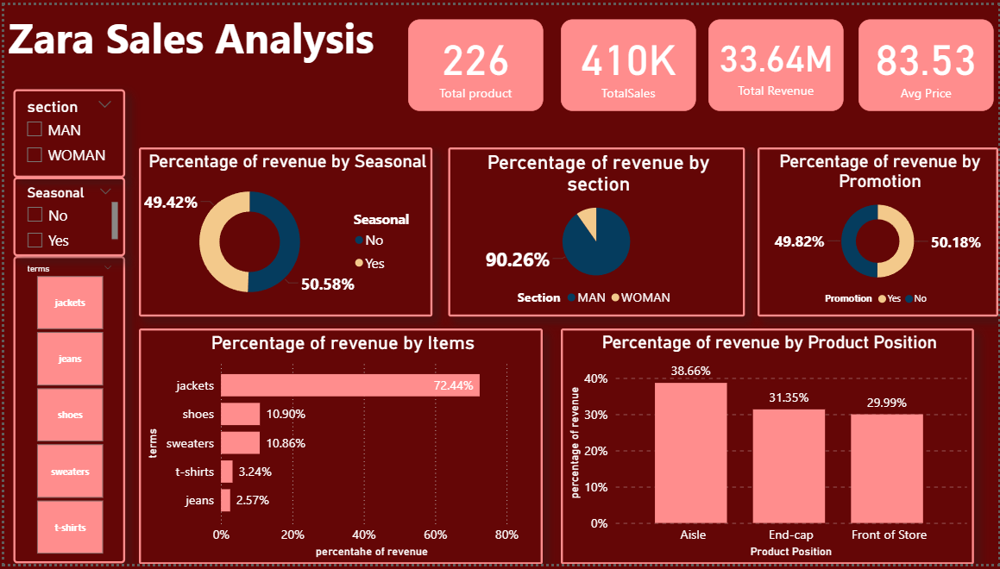

# Zara Sales Analysis Dashboard

This project features a comprehensive sales analysis dashboard for Zara, built with a business intelligence tool. The dashboard provides key insights into sales performance, product trends, and revenue distribution.

### **Key Metrics**

The dashboard's main header highlights key performance indicators (KPIs):

  - **Total Product:** 226
  - **Total Sales:** 410K
  - **Total Revenue:** $33.64M
  - **Average Price:** $83.53

### **Analysis Highlights**

The dashboard provides a breakdown of sales and revenue across various dimensions:

  - **Product Performance:** **Jackets** are the top-performing product, generating **72.44%** of the total revenue and leading in total units sold (240K). The "Plaid Overshirt" is the top-selling individual item by revenue.
  - **Section & Seasonal:** The **MAN** section accounts for **90.26%** of the total revenue. Additionally, products in the "Seasonal" category drive **50.58%** of the revenue.
  - **Placement & Promotion:** Products placed in the **Aisle** generate the highest revenue at **38.66%**. The revenue from promoted items is almost equal to non-promoted items, at around **49.82%** vs. **50.18%**.

### **Screenshots**

Here are snapshots of the dashboard:
    
    

